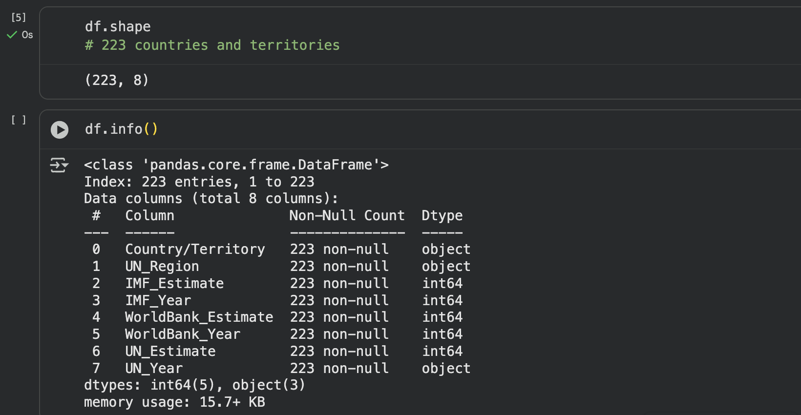

# Week 6 Python

In Week 6, I utilised the **pandas** library in Python for data analysis, along with **Matplotlib** and **Seaborn** for visualisations. I developed insight into **comparison operators** and created **conditional if statements** to control program flow based on varying conditions.

**Knowledge Gained:**

- Advantages of using Python in programming
- Python Libraries/Tools (e.g., Pandas, Matplotlib, and Seaborn)
- Comparison Operators
- Conditional (if) Statements

